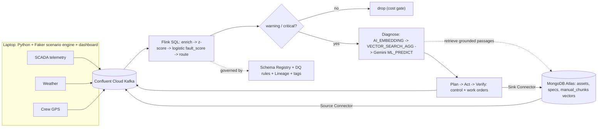

# GridSentinel

**Autonomous Grid & Critical-Asset Resilience Agent** - built for Confluent AI
Day India 2026. GridSentinel watches live SCADA-style telemetry from grid assets
(substations, transformers, transmission lines, pumps) and, entirely inside
**Confluent Cloud Flink**, predicts faults and autonomously **diagnoses
(RAG-grounded with Gemini), decides, acts, and verifies recovery** in real time.

It doesn't just chat - it acts: isolating a line, rerouting load, dispatching a
crew, and filing a work order, then confirming the asset returns to normal.

> Domain: Burns & McDonnell critical infrastructure (power T&D, water).
> All data is synthetic, so a dramatic failure-and-recovery can be triggered live.

## Architecture




## What runs where

GridSentinel is **cloud-only**. The laptop runs just two things; everything
else lives in Confluent Cloud + MongoDB Atlas:

| Laptop (Python) | Confluent Cloud + Atlas |
|---|---|
| `simulators.run_simulators` - pushes telemetry/weather/crew to Kafka and obeys `control` commands | Kafka + Schema Registry, MongoDB source/sink connectors |
| `dashboard/app.py` - live ops UI | **Flink SQL**: enrich -> z-score -> logistic fault_score -> route -> Gemini diagnosis (vector RAG) -> plan -> act -> verify |

Diagnosis uses **true vector RAG inside Flink**: `AI_EMBEDDING` +
`VECTOR_SEARCH_AGG` over the MongoDB Atlas `manual_chunks` index, grounding
Gemini (`ML_PREDICT`) on the retrieved passage.

## Quickstart

> Run every command from inside the `gridsentinel/` folder. Configuration is
> read from `gridsentinel/.env` (your copy of `gridsentinel/.env.example`).
> `.env` is git-ignored, so your secrets never get committed.

```bash
cd gridsentinel
pip install -r requirements.txt
cp .env.example .env          # then edit gridsentinel/.env with your creds
```

1. Fill in `gridsentinel/.env` - Confluent Cloud, MongoDB Atlas, and Vertex AI
   credentials. See `gridsentinel/.env.example` for each field.
2. Follow the phased, validated runbook in `gridsentinel/infra/confluent_cloud_setup.md`
   (cluster, topics, Atlas + vector index, connectors, Vertex AI connections, and
   the Flink run order). Each phase has a `scripts.doctor` / `scripts.tap` check.
3. Once the Flink jobs (`gridsentinel/flink/00`-`07`) are running, start the two
   laptop processes:

```bash
python -m simulators.run_simulators      # gridsentinel/simulators/run_simulators.py
streamlit run dashboard/app.py           # gridsentinel/dashboard/app.py
```

Then click **Trigger HEATWAVE** (or **OVERLOAD**) in the sidebar and watch
GridSentinel detect, diagnose, act, and recover. See
`gridsentinel/DEMO.md` for the on-stage script.

The codec auto-detects Avro vs JSON, so the laptop reads the Avro decision
topics Flink produces with no code changes.

## Repo map

All paths below are under `gridsentinel/`.

```
gridsentinel/
├─ .env.example                 # copy to .env (your creds) - read by common/config.py
├─ requirements.txt             # pip deps (laptop: simulator + dashboard)
├─ README.md  DEMO.md  BUSINESS_CASE.md
│
├─ common/                      # shared laptop code
│  ├─ config.py                 # loads .env -> settings + topic names
│  ├─ kafka_io.py               # Kafka producer/consumer, Avro/JSON auto-detect
│  ├─ mongo.py                  # MongoDB Atlas client
│  ├─ embeddings.py             # Vertex AI gemini-embedding-001 client (RAG corpus)
│  ├─ assets.py  crew.py        # synthetic fleet + crew definitions
│
├─ simulators/                  # the data-push script (laptop)
│  ├─ run_simulators.py         # streams telemetry/weather/crew, obeys `control`
│  ├─ engine.py                 # numpy/Faker physics + fault dynamics
│  └─ scenario.py               # inject HEATWAVE/OVERLOAD/etc. (CLI + dashboard)
│
├─ dashboard/                   # the live ops UI (laptop)
│  ├─ app.py                    # Streamlit entry: `streamlit run dashboard/app.py`
│  └─ state.py                  # consumes decision topics into in-memory state
│
├─ schemas/                     # Avro source contracts the laptop produces
│  ├─ register_schemas.py       # registers them in Schema Registry (governance)
│  └─ telemetry.avsc  weather.avsc  crew_location.avsc
│
├─ flink/                       # THE BRAIN - Confluent Cloud Flink SQL (run 00->07)
│  ├─ 00_tables.sql             # output topics/tables Flink writes to
│  ├─ 01_enrichment.sql         # join to MongoDB-sourced specs/registry
│  ├─ 02_anomaly.sql            # rolling z-score per asset
│  ├─ 03_scoring_routing.sql    # logistic fault_score + severity + cost gate
│  ├─ 04_ai_model.sql           # CREATE CONNECTION (Gemini) + CREATE MODEL
│  ├─ 05_diagnosis.sql          # AI_EMBEDDING -> VECTOR_SEARCH_AGG -> ML_PREDICT
│  ├─ 06_planning_action.sql    # validate action, pick crew, write control + WO
│  ├─ 07_verify.sql             # detect recovery -> resolved (closes the loop)
│  └─ README.md                 # run order + per-file detail
│
├─ data/                        # MongoDB reference data + RAG corpus (run once)
│  ├─ seed_mongo.py             # assets, asset_specs, crew, maintenance_history
│  ├─ embed_manuals.py          # chunk + embed manuals -> manual_chunks (3072-dim)
│  ├─ specs.py                  # asset spec sheets
│  └─ manuals/*.md              # the O&M docs that become the RAG corpus
│
├─ governance/                  # Schema Registry + Stream Governance assets
│  ├─ data_quality_rules.json  tags.json
│  └─ README.md
│
├─ scripts/                     # validation helpers (run after each setup phase)
│  ├─ doctor.py                 # `python -m scripts.doctor`  - connectivity check
│  └─ tap.py                    # `python -m scripts.tap <topic>` - peek messages
│
└─ infra/                       # cloud setup docs + connector configs
   ├─ confluent_cloud_setup.md  # the phased, validated runbook (START HERE)
   ├─ mongodb_atlas_setup.md    # Atlas cluster + vector index
   └─ connectors/               # mongodb_source.json, mongodb_sink_workorders.json
```

## Cost & anti-hallucination design

- A cost gate in Flink means the Gemini call only runs on genuine incidents.
- Diagnoses are grounded in retrieved spec sheets + manuals and must cite them.
- The planner may only choose from a constrained, validated action set.
- Flink does the deterministic heavy lifting; the model does last-mile reasoning.
